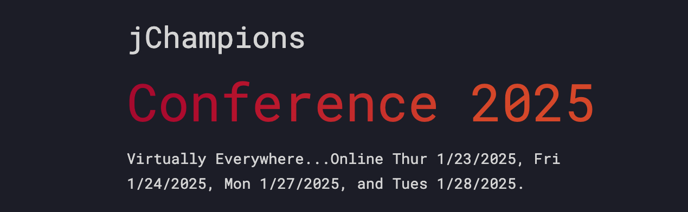

## Thursday, January 23, 2025

- **3:00pm CET** - **[Java's Concurrency Journey Continues! Exploring Structured Concurrency and Scoped Values](https://www.youtube.com/watch?v=w2COJX-1mgU)**  
  *Speaker:* Hanno Embregts

- **4:00pm CET** - **[Serverless Java in Action: Cloud Agnostic Design Patterns and Tips](https://www.youtube.com/watch?v=r-vHAjHx4Gw)**  
  *Speakers:* Kevin Dubois, Daniel Oh  

- **5:00pm CET** - **[Java for Small Coding Tasks](https://www.youtube.com/watch?v=KYt_CIb_-lM)**  
  *Speaker:* Cay Horstmann  

- **6:00pm CET** -  **[Six Jewels from Six Javas](https://www.youtube.com/watch?v=rh7HyTVGw8M)**  
  *Speaker:* Ian Darwin  

- **7:00pm CET** -  **[Translating a Cretan Book into English, German, Dutch, Chinese, etc. using Java and ChatGPT API](https://www.youtube.com/watch?v=vKf-l2QT5-0)**  
  *Speaker:* Heinz Kabutz  

- **8:00pm CET** -  **[Bootiful Spring Boot: A DOGumentary](https://www.youtube.com/watch?v=YH9ealsKr-8)**  
  *Speaker:* Josh Long  

- **9:00pm CET** -  **[Say Goodbye to Microservices, Say Hello to Self-Contained Systems](https://www.youtube.com/watch?v=N7l-_IX8jdQ)**  
  *Speaker:* Simon Martinelli  

---

## Friday, January 24, 2025

- **3:00pm CET** -  **[It Takes Two to Tango – Designing Module Interactions in Modulithic Spring Applications](https://www.youtube.com/watch?v=eiFnSevxAdk)**  
  *Speaker:* Oliver Drotbohm  

- **4:00pm CET** -  **[A Developer's Guide to Jakarta EE 11](https://www.youtube.com/watch?v=s9C8HQqYOlY)**  
  *Speaker:* Michael Redlich  

- **5:00pm CET** -  **[Secrets of Performance Tuning Java on Kubernetes](https://www.youtube.com/watch?v=UtFQ7mMb7ZA)**  
  *Speaker:* Bruno Borges  

- **6:00pm CET** -  **[Best Practices to Secure Web Applications](https://www.youtube.com/watch?v=P8O90GgxPIE)**  
  *Speaker:* Loiane Groner  

- **7:00pm CET** -  **[A Data-Oriented Programming Approach to REST APIs](https://www.youtube.com/watch?v=fmToimoSF4s)**  
  *Speaker:* Kenneth Kousen  

- **8:00pm CET** -  **[Java Developer Career Masterplan: 15 Steps to Grow Beyond Senior Developer](https://www.youtube.com/watch?v=486MSTVHP-w)**  
  *Speaker:* Bruno Souza  

- **9:00pm CET** -  **[Cracking Tricky Java Code Challenges From Java 8 to Java 24](https://www.youtube.com/watch?v=8erQSFxJuuc)**  
 *Speaker:* Rafael Del Nero  
 *Notes & source code:* [cracking-tricky-java-code-challenges](./cracking-tricky-java-code-challenges)

---

## Monday, January 27, 2025

- **3:00pm CET** -  **[Forking the Future: Embracing Microservices Evolution](https://www.youtube.com/watch?v=GA5oRt7DLbY)**  
  *Speaker:* Mohamed Taman  

- **4:00pm CET** -  **[Machine Learning + Symbolic Reasoning: A Quarkus Story on Artificial Intelligence](https://www.youtube.com/watch?v=s2DYbGJqFPg)**  
  *Speaker:* Mario Fusco  

- **5:00pm CET** -  **[How My Views on Teaching Java Have Changed](https://www.youtube.com/watch?v=ChEBO4d2U0o)**  
  *Speaker:* Kenneth Fogel  

- **6:00pm CET** -  **[Test-Driven Development: It's Easier Than You Think!](https://www.youtube.com/watch?v=jSLu6h01UEM)**  
  *Speaker:* Eric Deandrea  

- **7:00pm CET** -  **[Looking at Music, an Experiment with Kotlin, JavaFX, MIDI, and Virtual Threads](https://www.youtube.com/watch?v=UW6fDQt-8BI)**  
  *Speaker:* Frank Delporte  

- **8:00pm CET** -  **[Lessons Learnt from Founding My Own Company, and Over 30 Years Hands-On Coding](https://www.youtube.com/watch?v=t8Oq-Hr6ua8)**  
  *Speaker:* Peter Lawrey  

- **9:00pm CET** -  **[Managing Testing Data](https://www.youtube.com/watch?v=P5D7Bly5CNs)**  
  *Speaker:* Elias Nogueira  

---

## Tuesday, January 28, 2025

- **3:00pm CET** -  **[Java, Code Coverage and Their Best Friend - Bytecode: Scandals, Intrigues, Investigations](https://www.youtube.com/watch?v=ucIcIc1vAVU)**  
  *Speaker:* Evgeny Mandrikov  

- **4:00pm CET** -  **[Cómo a John Empezó a Gustarle TDD (En Lugar de Odiarlo)](https://www.youtube.com/watch?v=py05PKniRzw)**  
  *Speaker:* Nacho Cougil  

- **5:00pm CET** -  **[Your Cloud-Native Toolbox for Java](https://www.youtube.com/watch?v=4QVJLqmlOVk)**  
  *Speaker:* Rustam Mehmandarov  

- **6:00pm CET** -  **[Automatic Heap Sizing](https://www.youtube.com/watch?v=CMzxmdpgbRE)**  
  *Speakers:* Kirk Pepperdine, Saint Wesonga  

- **7:00pm CET** -  **[Java + LLMs: A Hands-On Guide to Building LLM Apps in Java with Jakarta](https://www.youtube.com/watch?v=4fFZjtDAXW0)**  
  *Speakers:* Bazlur Rahman, Syed M. Shaaf  
  [Session URL](https://www.youtube.com/watch?v=4fFZjtDAXW0)

- **8:00pm CET** -  **[Zero Waste, Radical Magic, and Italian Graft – Quarkus Efficiency Secrets](https://www.youtube.com/watch?v=AHKoriBmHu8)**  
  *Speaker:* Holly Cummins  

- **9:00pm CET** -  **[JTaccuino - A Better Jupyter Experience for Java Developers](https://www.youtube.com/watch?v=R1gHQtBXfYk)**  
  *Speaker:* Sven Reimershttps://www.youtube.com/watch?v=R1gHQtBXfYk
  [Session URL](https://www.youtube.com/watch?v=R1gHQtBXfYk)
